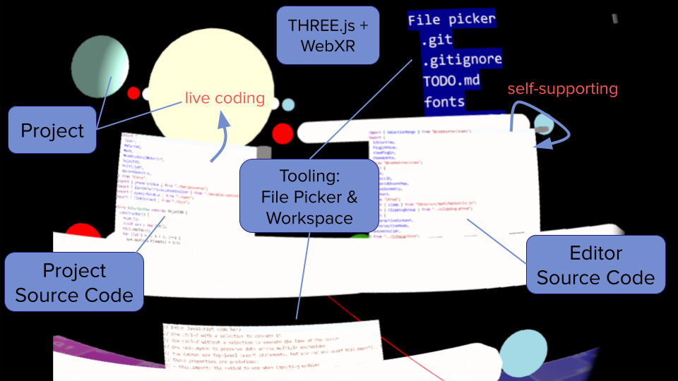

# Self-Supporting Development Loop in VR

This is a web-based development environment for VR that supports live coding. It
is self-supporting in the sense that you can edit the environment from within
itself. The project is built on [`THREE.js`](https://threejs.org/) and
[`WebXR`](https://immersiveweb.dev/).

### Hardware Requirements

- a VR headset that includes a web browser
- a Bluetooth keyboard

This project was tested with a [Meta Quest 2](https://www.meta.com/de/quest/products/quest-2/)
and a [Logitech K380](https://www.logitech.com/de-de/products/keyboards/k380-multi-device.html).

### Installation

- clone this repository
- run `npm install`
- install [`adb`](https://developer.android.com/tools/adb)
- download [`lsp-ws-proxy`](https://github.com/qualified/lsp-ws-proxy/releases/tag/v0.8.0)

### Running

- start your VR headset
- connect your Bluetooth keyboard to the headset
- connect the headset to your host via USB or WiFi
- run `adb devices`
- accept the connection attempt inside the headset
- run `adb reverse tcp:5173 tcp:5173`
- run `adb reverse tcp:9999 tcp:9999`
- run `npm run dev`
- in another terminal, run `lsp-ws-proxy --remap -- npx typescript-language-server --stdio`
- inside the headset, navigate to `http://localhost:5173`
- press _Enter VR_

### Usage

- see the [documentation](./Documentation.md)
